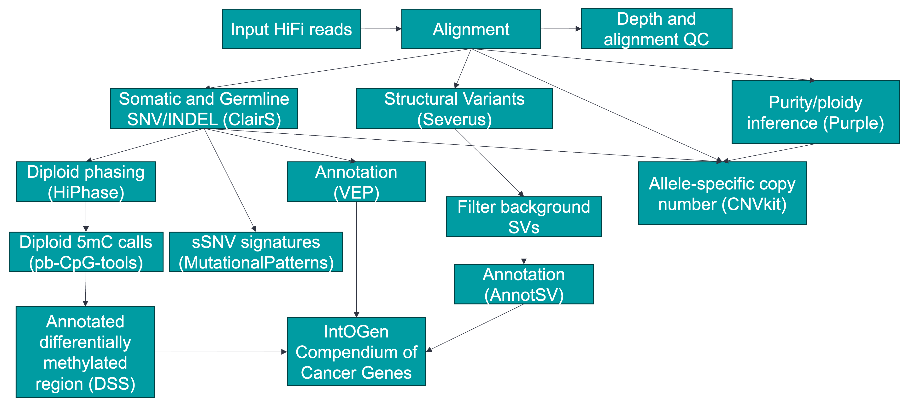

<h1 align="center"></h1>

<h1 align="center">HiFi somatic WDL</h1>

A somatic variant-calling workflow (tumor-only or matched tumor/normal) for HiFi data

See our tech note <a href="https://www.pacb.com/wp-content/uploads/Application-note-Robust-detection-of-somatic-variants-from-tumor-normal-samples-with-highly-accurate-long-read-whole-genome-sequencing.pdf">here</a> on somatic variant detection with HiFi sequencing.

---

<h1 align="center"></h1>

## Table of contents

- [Table of contents](#table-of-contents)
- [Installation and Dependencies](#installation-and-dependencies)
- [Usage](#usage)
- [Important outputs from workflow](#important-outputs-from-workflow)
  - [Small Variants (SNVs/INDELs)](#small-variants-snvsindels)
  - [Structural Variants and Copy Number](#structural-variants-and-copy-number)
  - [Methylation](#methylation)
  - [Other Analyses](#other-analyses)
  - [QC and Alignment Stats](#qc-and-alignment-stats)
- [Demo datasets](#demo-datasets)
- [References](#references)
- [Tools versions](#tools-versions)
- [Change logs](#change-logs)
- [DISCLAIMER](#disclaimer)

## Installation and Dependencies

The workflow is written in WDL version 1.0 ([Workflow Description Language](https://github.com/openwdl/wdl)). It depends on `miniwdl` and `singularity` (version 3 and later). `miniwdl` can be installed using Bioconda. The workflow can also be run using `Cromwell`. (See [here](docs/step-by-step.md#is-the-workflow-compatible-with-cromwell) for instructions, tested on version 86).

## Usage

A step-by-step tutorial demonstrating usage and an FAQ can be found [here](docs/step-by-step.md).

## Important outputs from workflow

The workflow will generate the following results in the `$OUTDIR/_LAST/out` folder. Please refer to [output](docs/output.md) for a more detailed description of the outputs. In the table below, "Tumor/Normal" indicates the output is specific to tumor/normal mode and will not exist in the tumor-only mode. An example of final HTML report from COLO829 dataset can be found [here](examples/COLO829_60-30_summary_report.html?raw=1) (Right click to save the file and double click to open it in a web browser).

### Small Variants (SNVs/INDELs)
| Folder | Description | Mode |
|--------|-------------|------|
| small_variant_vcf | DeepSomatic or ClairS SNV/INDEL (Unannotated VCF) | Both |
| small_variant_vcf_annotated | VEP-annotated SNV/INDEL (VCF format) | Both |
| small_variant_tsv_annotated | VEP annotation in TSV format | Both |
| small_variant_tsv_CCG | Variants in Cancer Genes (IntOGen Sep 24) | Both |
| normal_germline_small_variant_vcf | Germline variants in normal sample | Tumor/Normal |
| tumor_germline_small_variant_vcf | Germline variants in tumor sample | Both |
| normal_germline_small_variant_vcf_annotated | VEP-annotated germline variants | Tumor/Normal |

### Structural Variants and Copy Number
| Folder | Description | Mode |
|--------|-------------|------|
| AnnotatedSeverusSV | Annotated structural variants (AnnotSV TSV) | Both |
| Annotated*SV_intogen | SVs overlapping Cancer Genes | Both |
| Severus_filtered_vcf | Filtered Severus structural variants | Both |
| Severus_breakpoint_cluster(_all) | Breakpoint clusters (somatic/all) | Both |
| Severus_cluster_plots | Clusters visualization (HTML) | Both |
| cnvkit_cns_with_major_minor_CN | Copy number segments with purity/ploidy | Tumor/Normal |
| Purple_outputs | Purity, ploidy and allele-specific CNVs | Tumor/Normal |
| wakhan_cnv | Alternative CNV calls | Both |

### Methylation
| Folder | Description | Mode |
|--------|-------------|------|
| DMR_results | Raw differentially methylated regions | Tumor/Normal |
| DMR_annotated | Annotated methylated regions | Tumor/Normal |
| DMR_annotated_CCG | DMRs in Cancer Genes | Tumor/Normal |
| pileup_(normal/tumor)_bed | 5mC probability summaries | Tumor/Normal |

### Other Analyses
| Folder | Description | Mode |
|--------|-------------|------|
| mutsig_SNV_profile | Mutational profile plots | Both |
| mutsig_SNV | Mutational signatures (TSV) | Both |
| chord_hrd_prediction | HRD prediction results | Tumor/Normal |
| report | Summary HTML report | Both |

### QC and Alignment Stats
| Folder | Description | Mode |
|--------|-------------|------|
| mosdepth_*_summary | Coverage depth statistics | Both |
| overall_*_alignment_stats | Mapping statistics | Both |
| per_alignment_*_stats | Per-read alignment metrics | Both |
| aligned_RL_summary_* | Read length statistics | Both |
| normal_bams_phased | Phased normal BAM (Hiphase) | Tumor/Normal |
| tumor_bams_hiphase | Phased tumor BAM (Hiphase) | Both |

## Demo datasets 

There are two cancer cell lines sequenced on Revio systems, provided by PacBio:

1. COLO829 (60X tumor, 60X normal): <https://downloads.pacbcloud.com/public/revio/2023Q2/COLO829>
2. HCC1395 (60X tumor, 40X normal): <https://downloads.pacbcloud.com/public/revio/2023Q2/HCC1395/>

More datasets and benchmarking can be found on GitHub page of [Severus](https://github.com/KolmogorovLab/Severus) and DeepSomatic's [preprint](https://www.biorxiv.org/content/10.1101/2024.08.16.608331v1).

## References

  
References of tools used

Following are the references for the tools used in the workflow, which should be cited if you use the workflow. The list may not be exhaustive; we welcome suggestions for additional references.

1. Zheng, Z. et al. ClairS: a deep-learning method for long-read somatic small variant calling. 2023.08.17.553778 Preprint at <https://doi.org/10.1101/2023.08.17.553778> (2023).
2. English, A. C., Menon, V. K., Gibbs, R. A., Metcalf, G. A. & Sedlazeck, F. J. Truvari: refined structural variant comparison preserves allelic diversity. Genome Biology 23, 271 (2022).
3. Wang, T. et al. The Human Pangenome Project: a global resource to map genomic diversity. Nature 604, 437–446 (2022).
4. Danecek, P. et al. Twelve years of SAMtools and BCFtools. GigaScience 10, giab008 (2021).
5. Li, H. Minimap2: pairwise alignment for nucleotide sequences. Bioinformatics 34, 3094–3100 (2018).
6. Sedlazeck, F. J. et al. Accurate detection of complex structural variations using single molecule sequencing. Nat Methods 15, 461–468 (2018).
7. Pedersen, B. S. & Quinlan, A. R. Mosdepth: quick coverage calculation for genomes and exomes. Bioinformatics 34, 867–868 (2018).
8. McLaren, W. et al. The Ensembl Variant Effect Predictor. Genome Biology 17, 122 (2016).
9. Park, Y. & Wu, H. Differential methylation analysis for BS-seq data under general experimental design. Bioinformatics 32, 1446–1453 (2016).
10. Talevich, E., Shain, A. H., Botton, T. & Bastian, B. C. CNVkit: Genome-Wide Copy Number Detection and Visualization from Targeted DNA Sequencing. PLoS Comput Biol 12, e1004873 (2016).
11. Martínez-Jiménez, F. et al. A compendium of mutational cancer driver genes. Nat Rev Cancer 20, 555–572 (2020). <https://www.intogen.org>
12. Manders, F. et al. MutationalPatterns: the one stop shop for the analysis of mutational processes. BMC Genomics 23, 134 (2022).
13. Lin, J.-H., Chen, L.-C., Yu, S.-C. & Huang, Y.-T. LongPhase: an ultra-fast chromosome-scale phasing algorithm for small and large variants. Bioinformatics 38, 1816–1822 (2022).
14. HMFtools suite (Amber, Cobalt and Purple): <https://github.com/hartwigmedical/hmftools/tree/master>.
15. Park, J. et al. DeepSomatic: Accurate somatic small variant discovery for multiple sequencing technologies. 2024.08.16.608331 Preprint at https://doi.org/10.1101/2024.08.16.608331 (2024).
16. Elrick, H. et al. SAVANA: reliable analysis of somatic structural variants and copy number aberrations in clinical samples using long-read sequencing. 2024.07.25.604944 Preprint at https://doi.org/10.1101/2024.07.25.604944 (2024).
17. Nguyen, L., W. M. Martens, J., Van Hoeck, A. & Cuppen, E. Pan-cancer landscape of homologous recombination deficiency. Nat Commun 11, 5584 (2020).
18. Keskus, A. et al. Severus: accurate detection and characterization of somatic structural variation in tumor genomes using long reads. 2024.03.22.24304756 Preprint at https://doi.org/10.1101/2024.03.22.24304756 (2024).

## Tools versions

  
Tools used in the workflow

| Tool         | Version   | Purpose                                              | Container |
| ------------ | --------- | ---------------------------------------------------- | --------- |
| pbmm2        | 1.14.99    | Alignment of HiFi reads                              | [quay.io](https://quay.io/repository/biocontainers/pbmm2) |
| pbtk         | 3.1.0     | Merging HiFi reads                                   | [quay.io](https://quay.io/repository/biocontainers/pbtk) |
| samtools     | 1.17      | Various tasks manipulating BAM files                 | [quay.io](https://quay.io/repository/biocontainers/samtools) |
| VEP          | 110.1     | Annotation of small variants                         | [docker](ensemblorg/ensembl-vep) |
| AnnotSV     | 3.4.12    | Annotation of structural variants                    | [quay.io](https://quay.io/repository/biocontainers/annotsv) |
| DSS          | 2.48.0    | Differential methylation                             | [self-hosted on quay.io](https://quay.io/pacbio/somatic_r_tools) |
| annotatr     | 1.26.0    | Annotation of differentially methylated region (DMR) | [self-hosted on quay.io](https://quay.io/pacbio/somatic_r_tools) |
| ClairS       | 0.4.1     | Somatic SNV and INDEL caller                         | [docker](https://hub.docker.com/r/hkubal/clairs/tags) |
| bcftools     | 1.17      | Manipulation of VCF                                  | [quay.io](https://quay.io/repository/biocontainers/bcftools) |
| CNVKit       | 0.9.10    | Copy number segmentation                             | [quay.io](https://quay.io/repository/biocontainers/cnvkit) |
| Truvari      | 4.0.0     | Filtering of control structural variants (Deprecated, using svpack instead) | [quay.io](https://quay.io/repository/biocontainers/truvari) |
| bedtools     | 2.31.0    | Splitting genome intervals for parallelization       | [quay.io](https://quay.io/repository/biocontainers/bedtools) |
| mosdepth     | 0.3.4     | Calculating depth of coverage                        | [quay.io](https://quay.io/repository/biocontainers/mosdepth) |
| pb-CpG-tools | 2.3.1     | Summarizing 5mC probability                          | [quay.io](https://quay.io/pacbio/pb-cpg-tools) |
| HiPhase      | 1.4.5     | Diploid phasing using germline variants              | [quay.io](https://quay.io/repository/biocontainers/hiphase) |
| slivar       | 0.3.0     | Selecting/filtering variants from VCF                | [quay.io](https://quay.io/repository/biocontainers/slivar) |
| Severus      | 1.3       | Structural variants                                  | [quay.io](https://quay.io/repository/biocontainers/severus) |
| seqkit       | 2.5.1     | Aligned BAM statistics                               | [quay.io](https://quay.io/repository/biocontainers/seqkit) |
| csvtk        | 0.27.2    | Aligned BAM statistics summary and other CSV/TSV operation | [quay.io](https://quay.io/repository/biocontainers/csvtk) |
| IntOGen      | Sep 30 2024 | Compendium of Cancer Genes for annotation          | [self-hosted on quay.io](https://quay.io/pacbio/somatic_r_tools) |
| Mitelman database | Jan 15 2025 | Database of chromosomal aberrations in cancer (`MCGENE.TXT` file used)      | [self-hosted on quay.io](https://quay.io/pacbio/somatic_general_tools) |
| MutationalPattern | 3.10.0 | Mutational signatures based on SNV                 | [quay.io](https://quay.io/pacbio/somatic_r_tools) |
| Amber        | v4.0      | BAF segmentation (HMFtools suite)                    | [self-hosted on quay.io](https://quay.io/pacbio/purple) |
| Cobalt       | v1.16.0   | Log ratio segmentation (HMFtools suite)              | [self-hosted on quay.io](https://quay.io/pacbio/purple) |
| Purple       | v4.0      | Purity and ploidy estimate, somatic CNV (HMFtools suite) | [self-hosted on quay.io](https://quay.io/pacbio/purple) |
| DeepSomatic  | v1.7.0    | Somatic SNV/INDELs caller                            | [docker](https://hub.docker.com/r/google/deepsomatic/) |
| CHORD        | v2.0.0    | HRD prediction                                       | [docker](https://hub.docker.com/r/scwatts/hmftools-chord) |
| SAVANA       | v1.2.3    | Structural variants and copy number variants caller  | [quay.io](https://quay.io/repository/biocontainers/savana) |
| Wakhan | v0.1.0 | Copy number variants caller | [docker](https://hub.docker.com/mkolmogo/wakhan) |

## Change logs

  
Click to expand changelogs:

- v0.9:
  - Tumor-only workflow is now supported. See [here](docs/step-by-step.md) for instructions.
  - Updated Severus to 1.3.
  - BND pairs can sometimes be missing due to svpack filtering just one of the pairs. The missing pair is now added back to the VCF.
  - Diploid phasing should now work on the DeepSomatic's VCF.
  - Added back MODERATE impact SNV/INDELs to the report.
  - Updated Compendium of Cancer Gene to 2024-9-30.
  - Added circos plot for structural variants BND events.
  - Removed Longphase as an optional phasing tool (HiPhase no longer fails due to OOM errors).
  - Added Wakhan output for CNV calling in both tumor-only and tumor/normal workflow. This is experimental and you can find the output
    in the `wakhan_cnv` folder.
  - Updated ClairS to 0.4.1 (Uses `hifi_revio_ssrs` model by default).

- v0.8.2:
  - Fixed a small bug in the report that causes the report to fail to render when there's zero variants.
  
- v0.8.1:
  - Move BND square bracket annotation for VCF to INFO field to avoid
    AnnotSV from harmonizing the BND format (Does not work well with long-reads SVs).
  - Fixed a bug preventing `skip_align` from working properly.
  - Added option to produce [SAVANA](https://github.com/cortes-ciriano-lab/savana) output. This is experimental and can be enabled with `hifisomatic.run_savana` in the input JSON.
    - Note that currrently the output for SAVANA is not annotated or used for any further downstream processing.
  - Updated Severus to 1.2.0.
  - `bcftools norm` on small variants before annotation.
  - Updated HiPhase to 1.4.5.
  - Updated reference list.
  
- v0.8:
  - Updated DeepSomatic to v1.7.0. This resulted in a significant improve in INDEL recall. See benchmark from DeepSomatic preprint for more comparisons.
  - Updated AnnotSV to 3.4.2. Please update AnnotSV cache by following the instructions in the step-by-step tutorial [here](docs/step-by-step.md).
  - Updated pbmm2 to 1.14.99 (With `-A2` option for better alignment of some complex SV with short supplementary segments, e.g. truthset_41 in COLO829).
  - Updated Severus to version 1.1.
    - Note that in COLO829 `truthset_19` becomes a FN with Severus 1.1. See issue [here](https://github.com/KolmogorovLab/Severus/issues/15).
  - Updated report format to become easier to read.
  - Resource bundle now uses germline SVs called with Severus instead of the previous Sniffles2 SV set. Please update resource bundle from Zenodo.
  - Simplified kinetics stripping directly in pbmm2.
  - Modified Amber to use the same pcf gamma as Cobalt. It was previously using a value of 100, while Cobalt was using 1000. 
    This change will make the segmentation more consistent between Amber and Cobalt and should improve purity/ploidy estimates.
  - Better logic with merging BAMs in the workflow (No more redundant merging when n_bam=1).
  - Suppressed a warning causing failures in Cobalt with CIGAR error in the BAM file. This is [known](https://github.com/hartwigmedical/hmftools/issues/535).
  - Incorporated pull request from [here](https://github.com/PacificBiosciences/HiFi-somatic-WDL/pull/6) for Cromwell on Azure (not tested).

- v0.7:
  - Updated DeepSomatic to v1.6.1.
  - Pipeline now calls DeepSomatic in chunks.

- v0.6.2:
  - Added experimental CHORD HRD (Homologous Recombination Deficiency) prediction. See [here](docs/output.md#homologous-recombination-deficiency-prediction) for details.
  - Renamed some variables (legacy Sniffles parameters).
  - Swap CNVkit visualization to Purple in report.
  - Made changes in WDL for compatibility with Cromwell.
  - Allow specifying min/max purity/ploidy for Purple (In task WDL)

- v0.6.1:
  - Updated documentation and benchmark.
  - Small bugfix in tabix indexing of VCFs.
  - Added HTML report for summary metrics.
  - Fixed a bug where germline VCFs are not output when using DeepSomatic.
  - Fixed a bug introduced in svpack filtering where entries with `SVLEN=0`.
    are filtered out (They should not be).
 
- v0.6:
  - Added DeepSomatic 1.6.0 (Experimental and disabled by default. Enable with `hifisomatic.use_deepsomatic` in input JSON). Note that DeepSomatic is computationally expensive compared to ClairS so we recommend disabling it if computational resources are limited. See benchmark [here](docs/benchmark.md) for comparison between ClairS and DeepSomatic.
  - Use `svpack` to filter for control SVs (previously using truvari) and provide simple annotation in filtered VCF.
  - Switch to using `samtools` to strip kinetics.

- v0.5:
  - Updated Cobalt to 4.0. It now counts read depth correctly. See [here](https://github.com/hartwigmedical/hmftools/issues/485) for details.
  - Containers are now on pacbio quay.io.
  - SV calling now only uses Severus.
  - Individual tasks now output the version number in stdout.

- v0.4:
  - Added purity, ploidy and somatic CNV with Amber, Cobalt and Purple
    - Note that Cobalt doesn't count the read depth from long-reads correctly so
      it'll affect the segmentation accuracy. However, purity and ploidy
      estimation appears to be robust.
  - CNVKit segmentation results recalled with purity and ploidy estimate from Purple.
  - Severus release now updated with Bioconda container.
  - Fixed an issue when call_smallvariants is set to false (Issue #1).

- v0.3:
  - Added IntOGen filtering of SV/SNV/INDEL/DMR.
  - Added mutational signature analysis.
  - Added germline small variants annotation with VEP (optional).
  - Added Longphase as an optional phasing tool.
  - Better documentation of output in [output](docs/output.md).
  
- v0.2:
  - Downgraded to WDL 1.0 for better compatibility. 
  - Added run time attribute to tasks for future support on cloud (not tested yet).
  
- v0.1: Initial release.

## DISCLAIMER

TO THE GREATEST EXTENT PERMITTED BY APPLICABLE LAW, THIS WEBSITE AND ITS CONTENT, INCLUDING ALL SOFTWARE, SOFTWARE CODE, SITE-RELATED SERVICES, AND DATA, ARE PROVIDED "AS IS," WITH ALL FAULTS, WITH NO REPRESENTATIONS OR WARRANTIES OF ANY KIND, EITHER EXPRESS OR IMPLIED, INCLUDING, BUT NOT LIMITED TO, ANY WARRANTIES OF MERCHANTABILITY, SATISFACTORY QUALITY, NON-INFRINGEMENT OR FITNESS FOR A PARTICULAR PURPOSE. ALL WARRANTIES ARE REJECTED AND DISCLAIMED. YOU ASSUME TOTAL RESPONSIBILITY AND RISK FOR YOUR USE OF THE FOREGOING. PACBIO IS NOT OBLIGATED TO PROVIDE ANY SUPPORT FOR ANY OF THE FOREGOING, AND ANY SUPPORT PACBIO DOES PROVIDE IS SIMILARLY PROVIDED WITHOUT REPRESENTATION OR WARRANTY OF ANY KIND. NO ORAL OR WRITTEN INFORMATION OR ADVICE SHALL CREATE A REPRESENTATION OR WARRANTY OF ANY KIND. ANY REFERENCES TO SPECIFIC PRODUCTS OR SERVICES ON THE WEBSITES DO NOT CONSTITUTE OR IMPLY A RECOMMENDATION OR ENDORSEMENT BY PACBIO.
