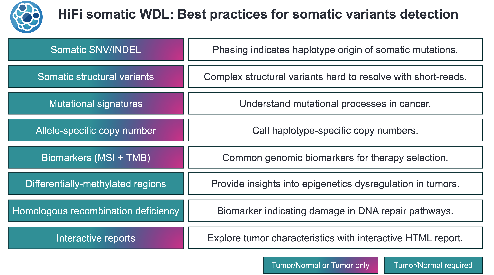

# wdl-hifisomatic: A tumor-normal variant calling workflow based on HiFi reads

- [wdl-hifisomatic: A tumor-normal variant calling workflow based on HiFi reads](#wdl-hifisomatic-a-tumor-normal-variant-calling-workflow-based-on-hifi-reads)
  - [Usage](#usage)
  - [Important outputs from workflow](#important-outputs-from-workflow)
  - [Demo datasets and accuracy of the workflow](#demo-datasets-and-accuracy-of-the-workflow)
  - [References](#references)
  - [Tools versions](#tools-versions)
  - [Change logs](#change-logs)
  - [DISCLAIMER](#disclaimer)

Full DAG of the workflow can be found [here](figures/complex_workflow_diagram.png)

## Usage

This workflow is written based on the [Workflow Description Language](https://github.com/openwdl/wdl). It depends on `miniwdl` and `singularity` (version 3 and above). `miniwdl` can be installed using Bioconda.

A step-by-step tutorial and FAQ can be found [here](docs/step-by-step.md).

## Important outputs from workflow

Upon completion the workflow will generate the following (non-exhaustive list) results in the `$OUTDIR/_LAST/out` folder:

| Folder                            | Types of results                                                                  |
| --------------------------------- | --------------------------------------------------------------------------------- |
| AnnotatedSeverusSV                | Severus structural variants annotated with AnnotSV (TSV)                          |
| AnnotatedSnifflesSV               | Sniffles structural variants annotated with AnnotSV (TSV)                         |
| small_variant_vcf_annotated       | ClairS SNV/INDEL annotated with VEP (VCF)                                         |
| DMR_annotated                     | Differentially methylated region annotated with genes/introns/promoters etc (TSV) |
| DMR_results                       | Differentially methylated region (Unannotated, TSV)                               |
| mosdepth_normal_summary           | Depth of coverage of normal (TXT)                                                 |
| mosdepth_tumor_summary            | Depth of coverage of tumor (TXT)                                                  |
| normal_bams_phased                | Phased normal BAM file                                                            |
| tumor_bams_phased                 | Phased tumor BAM file                                                             |
| overall_(tumor\|normal)_alignment_stats      | Alignment overall statistics (Mapped %)                                                    |
| per_alignment_(tumor\|normal)_stats| Statistics (accuracy/n_mismatches/length) for each alignment                     |
| aligned_RL_summary_(tumor\|normal)| Aligned read length N50, mean and median                     |
| normal_germline_small_variant_vcf | Germline variants in normal (VCF)                                                 |
| tumor_germline_small_variant_vcf  | Germline variants in tumor (VCF)                                                  |
| pileup_normal_bed                 | Summarized 5mC probability  in normal(BED)                                        |
| pileup_tumor_bed                  | Summarized 5mC probability in tumor (BED)                                         |
| cnvkit_output                     | Copy number segments (BED)                                                        |
| sniffles_somatic_vcf_filterHPRC   | Sniffles structural variants (Unannotated VCF)                                    |
| Severus_filterHPRC_vcf            | Severus structural variants (Unannotated VCF)                                     |
| small_variant_vcf                 | ClairS SNV/INDEL (Unannotated VCF)                                                |

## Demo datasets and accuracy of the workflow

There are two cancer cell lines sequenced on Revio and provided by PacBio:

1. COLO829 (60X tumor, 60X normal): <https://downloads.pacbcloud.com/public/revio/2023Q2/COLO829>
2. HCC1395 (60X tumor, 40X normal): <https://downloads.pacbcloud.com/public/revio/2023Q2/HCC1395/>

A benchmark of both cell lines can be found [here](docs/benchmark.md).

## References

Following are the references for the tools used in the workflow and should be cited if you use the workflow. The list may not be exhaustive and we welcome suggestions for additional references.

1. Zheng, Z. et al. ClairS: a deep-learning method for long-read somatic small variant calling. 2023.08.17.553778 Preprint at <https://doi.org/10.1101/2023.08.17.553778> (2023).
2. English, A. C., Menon, V. K., Gibbs, R. A., Metcalf, G. A. & Sedlazeck, F. J. Truvari: refined structural variant comparison preserves allelic diversity. Genome Biology 23, 271 (2022).
3. Wang, T. et al. The Human Pangenome Project: a global resource to map genomic diversity. Nature 604, 437–446 (2022).
4. Danecek, P. et al. Twelve years of SAMtools and BCFtools. GigaScience 10, giab008 (2021).
5. Li, H. Minimap2: pairwise alignment for nucleotide sequences. Bioinformatics 34, 3094–3100 (2018).
6. Sedlazeck, F. J. et al. Accurate detection of complex structural variations using single molecule sequencing. Nat Methods 15, 461–468 (2018).
7. Pedersen, B. S. & Quinlan, A. R. Mosdepth: quick coverage calculation for genomes and exomes. Bioinformatics 34, 867–868 (2018).
8. McLaren, W. et al. The Ensembl Variant Effect Predictor. Genome Biology 17, 122 (2016).
9. Park, Y. & Wu, H. Differential methylation analysis for BS-seq data under general experimental design. Bioinformatics 32, 1446–1453 (2016).
10. Talevich, E., Shain, A. H., Botton, T. & Bastian, B. C. CNVkit: Genome-Wide Copy Number Detection and Visualization from Targeted DNA Sequencing. PLoS Comput Biol 12, e1004873 (2016).

## Tools versions

  
Tools used in the workflow

| Tool         | Version   | Purpose                                              |
| ------------ | --------- | ---------------------------------------------------- |
| pbmm2        | 1.12.0    | Alignment of HiFi reads                              |
| pbtk         | 3.1.0     | Merging HiFi reads                                   |
| samtools     | 1.17      | Various tasks manipulating BAM files                 |
| VEP          | 110.1     | Annotation of small variants                         |
| AnnotSV      | 3.3.6     | Annotation of structural variants                    |
| DSS          | 2.48.0    | Differential methylation                             |
| annotatr     | 1.26.0    | Annotation of differentially methylated region (DMR) |
| ClairS       | 0.1.5     | SNV and INDEL calling                                |
| bcftools     | 1.17      | Manipulation of VCF                                  |
| CNVKit       | 0.9.10    | Copy number segmentation                             |
| Truvari      | 4.0.0     | Filtering of control structural variants             |
| bedtools     | 2.31.0    | Splitting genome intervals for parallelization       |
| mosdepth     | 0.3.4     | Calculating depth of coverage                        |
| pb-CpG-tools | 2.3.1     | Summarizing 5mC probability                          |
| fgbio        | 2.1.0     | Stripping kinetics from BAM files                    |
| HiPhase      | 0.10.2    | Diploid phasing using germline variants              |
| Sniffles     | 2.0.7     | Structural variants                                  |
| slivar       | 0.3.0     | Selecting/filtering variants from VCF                |
| Severus      | 21-Aug-23 | Structural variants                                  |
| seqkit       | 2.5.1     | Aligned BAM statistics                               |
| csvtk        | 0.27.2    | Aligned BAM statistics summary                       |

## Change logs

  
Click to expand changelogs:

- v0.1: Initial release

## DISCLAIMER

TO THE GREATEST EXTENT PERMITTED BY APPLICABLE LAW, THIS WEBSITE AND ITS CONTENT, INCLUDING ALL SOFTWARE, SOFTWARE CODE, SITE-RELATED SERVICES, AND DATA, ARE PROVIDED "AS IS," WITH ALL FAULTS, WITH NO REPRESENTATIONS OR WARRANTIES OF ANY KIND, EITHER EXPRESS OR IMPLIED, INCLUDING, BUT NOT LIMITED TO, ANY WARRANTIES OF MERCHANTABILITY, SATISFACTORY QUALITY, NON-INFRINGEMENT OR FITNESS FOR A PARTICULAR PURPOSE. ALL WARRANTIES ARE REJECTED AND DISCLAIMED. YOU ASSUME TOTAL RESPONSIBILITY AND RISK FOR YOUR USE OF THE FOREGOING. PACBIO IS NOT OBLIGATED TO PROVIDE ANY SUPPORT FOR ANY OF THE FOREGOING, AND ANY SUPPORT PACBIO DOES PROVIDE IS SIMILARLY PROVIDED WITHOUT REPRESENTATION OR WARRANTY OF ANY KIND. NO ORAL OR WRITTEN INFORMATION OR ADVICE SHALL CREATE A REPRESENTATION OR WARRANTY OF ANY KIND. ANY REFERENCES TO SPECIFIC PRODUCTS OR SERVICES ON THE WEBSITES DO NOT CONSTITUTE OR IMPLY A RECOMMENDATION OR ENDORSEMENT BY PACBIO.
