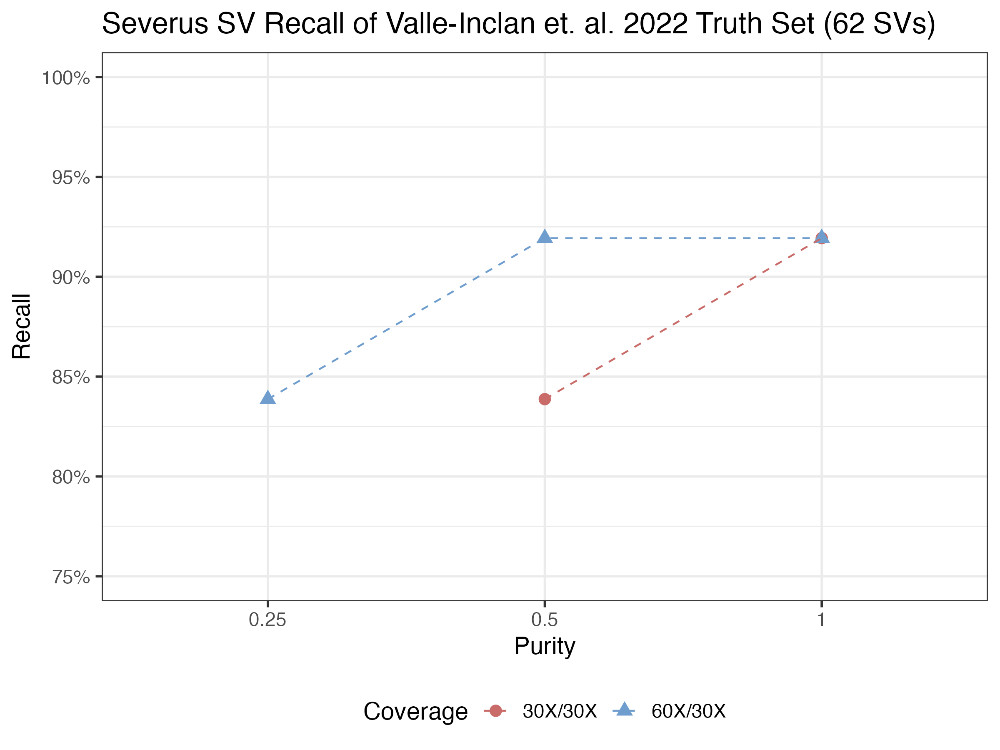
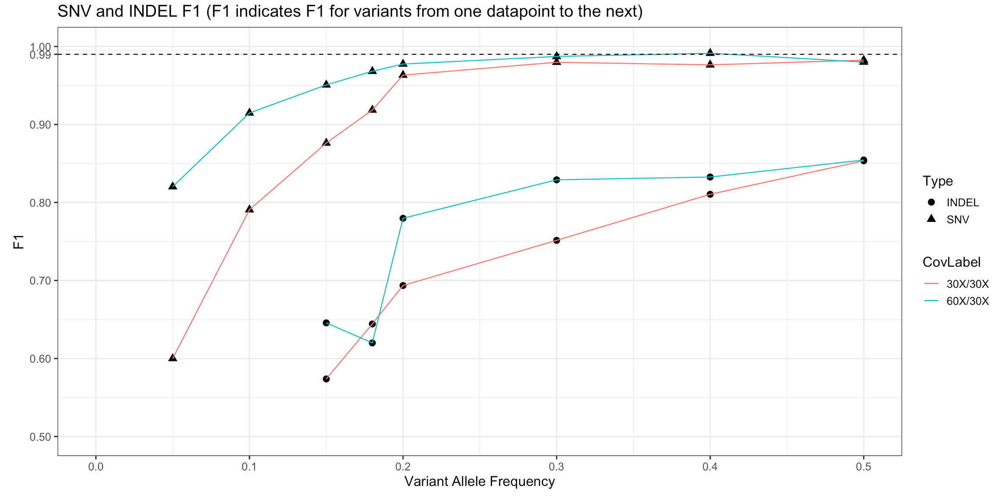

# Benchmarking COLO829 (structural variants) and HCC1395 (SNV/INDEL) with the workflow

In order to simulate tumor purity, we downsampled the aligned BAM file using samtools and mixed the normal and tumor datasets.
For example, at 50% purity the mixture consists of 30-fold coverage tumor merged with 30-fold normal coverage.

### Structural variants recall for COLO829 (Severus)

Truth sets were obtained from Valle-Inclan et. al. 2022 [(Zenodo record)](https://zenodo.org/record/6426985). The benchmark was carried out
using `truvari` with the parameter of `-p 0 -s 0 -S 0 --sizemax 100000000 --dup-to-ins`. The following results were obtained from the Severus' VCF file. Note that Severus produces "SVLEN=0" for some BND calls. For `truvari` to work in matching BND breakpoints, we removed the string "SVLEN=0;" in the VCF before running `truvari`. Finally, all 57 known SVs (truth) called at 60-fold coverage (100% purity) were manually checked to ensure Truvari was correctly matching the SVs.

At 30X, it is also possible to achieve maximum recall of 92% (57/62 truth SVs) by setting the `severus_min_reads` parameter to require just 2 supporting reads for Severus. However, this will increase the number of false-positives, so it is a trade-off that user needs to decide. By default we follow Severus' recommendation which is a minimum support of 3 reads. The table and figure below shows the accuracy performance with a minimum support of 3 reads.

| Normal coverage | Tumor coverage | Purity | Truth SV Called | Total SV Called | Recall (Truth / 62) | Precision | F1  | Remark                   |
| --------------- | -------------- | ------ | --------------- | --------------- | ------------------- | --------- | --- | ------------------------ |
| 30              | 30             | 0.25   | 30              | 39              | 48%                 | 77%       | 59% |                          |
| 30              | 30             | 0.5    | 48              | 65              | 77%                 | 74%       | 76% |                          |
| 30              | 30             | 1      | 54              | 92              | 87%                 | 59%       | 70% | truthset_4 called as BND |
| 30              | 60             | 0.25   | 46              | 82              | 74%                 | 56%       | 64% |                          |
| 30              | 60             | 0.5    | 54              | 94              | 87%                 | 57%       | 69% |                          |
| 30              | 60             | 1      | 57              | 157             | 92%                 | 36%       | 52% | truthset_4 called as BND |
| 60              | 60             | 0.25   | 46              | 66              | 74%                 | 70%       | 72% |                          |
| 60              | 60             | 0.5    | 54              | 84              | 87%                 | 64%       | 74% |                          |
| 60              | 60             | 1      | 57              | 126             | 92%                 | 45%       | 61% | truthset_4 called as BND |

There were four structural variants that Severus failed to called. `truthset_13` and `truthset_42` did not show any evidence based on manual inspection via IGV. `truthset_32` has 2/102 reads supporting the alternative allele (2% VAF). `truthset_51` did not have any coverage in the normal. Finally, `truthset_52` was part of a complex structural variant chain with truthset 19, 20, 53 and 54.

### Small variants recall for HCC1395 (ClairS 0.1.6 and DeepSomatic 1.6.0)

Truth sets were obtained from SEQC2 [website](https://sites.google.com/view/seqc2/home/data-analysis) (v1.2.1) and we compared
the VCFs using [`som.py`](https://github.com/Illumina/hap.py/blob/master/doc/sompy.md). Note that this is different from the benchmarking
method in the ClairS preprint where truth variants that do not have any supporting reads or have very low coverage in the tumor BAM are removed. We did not remove any truth variants in this benchmark.

Figure below shows the performance of ClairS and DeepSomatic at different coverage for SNV and INDELs.

    
Table of overall accuracy across all allele frequencies

| Tumor Coverage | Normal Coverage | Purity | type     | total.truth | total.query | tp    | fp   | fn    | recall  | precision | F1     | all_errors (fp+fn) | Platform               |
| -------------- | --------------- | ------ | -------- | ----------- | ----------- | ----- | ---- | ----- | ------- | --------- | ------ | ------------------ | ---------------------- |
| 30             | 30              | 1      | indels   | 1602        | 1547        | 1074  | 473  | 528   | 0.67041 | 0.69425   | 68.21% | 1001               | HiFi ClairS 0.1.6      |
| 30             | 30              | 1      | SNVs     | 39447       | 36984       | 34210 | 2774 | 5237  | 0.86724 | 0.92499   | 89.52% | 8011               | HiFi ClairS 0.1.6      |
| 30             | 30              | 1      | combined | 41049       | 38531       | 35284 | 3247 | 5765  | 0.85956 | 0.91573   | 88.68% | 9012               | HiFi ClairS 0.1.6      |
| 60             | 30              | 1      | indels   | 1602        | 1475        | 1103  | 372  | 499   | 0.68851 | 0.7478    | 71.69% | 871                | HiFi ClairS 0.1.6      |
| 60             | 30              | 1      | SNVs     | 39447       | 38830       | 36249 | 2581 | 3198  | 0.91893 | 0.93353   | 92.62% | 5779               | HiFi ClairS 0.1.6      |
| 60             | 30              | 1      | records  | 41049       | 40305       | 37352 | 2953 | 3697  | 0.90994 | 0.92673   | 91.83% | 6650               | HiFi ClairS 0.1.6      |
| 30             | 30              | 1      | indels   | 1602        | 999         | 953   | 46   | 649   | 0.59488 | 0.95395   | 73.28% | 695                | HiFi DeepSomatic 1.6.0 |
| 30             | 30              | 1      | SNVs     | 39447       | 34940       | 34133 | 807  | 5314  | 0.86529 | 0.9769    | 91.77% | 6121               | HiFi DeepSomatic 1.6.0 |
| 30             | 30              | 1      | records  | 41049       | 35939       | 35086 | 853  | 5963  | 0.85473 | 0.97627   | 91.15% | 6816               | HiFi DeepSomatic 1.6.0 |
| 60             | 30              | 1      | indels   | 1602        | 1270        | 1180  | 90   | 422   | 0.73658 | 0.92913   | 82.17% | 512                | HiFi DeepSomatic 1.6.0 |
| 60             | 30              | 1      | SNVs     | 39447       | 38291       | 36874 | 1417 | 2573  | 0.93477 | 0.96299   | 94.87% | 3990               | HiFi DeepSomatic 1.6.0 |
| 60             | 30              | 1      | records  | 41049       | 39561       | 38054 | 1507 | 2995  | 0.92704 | 0.96191   | 94.42% | 4502               | HiFi DeepSomatic 1.6.0 |

 

The following figure shows performance at different AF threshold comparing ClairS and 
DeepSomatic. The ClairS `cal_af_distribution` script was used to generate the allele frequencies
of the truthset based on the pileup of the BAM files used to generate the call. Only positions 
with at least 1 alt allele count are considered in the benchmarking. This also allows us to bin 
the truth allele frequencies based on the input dataset. The alternative is to directly bin the 
truth set using the TVAF tag, but this will not be able to capture the true allele frequencies
as they were calculated based on the original short-reads dataset.

